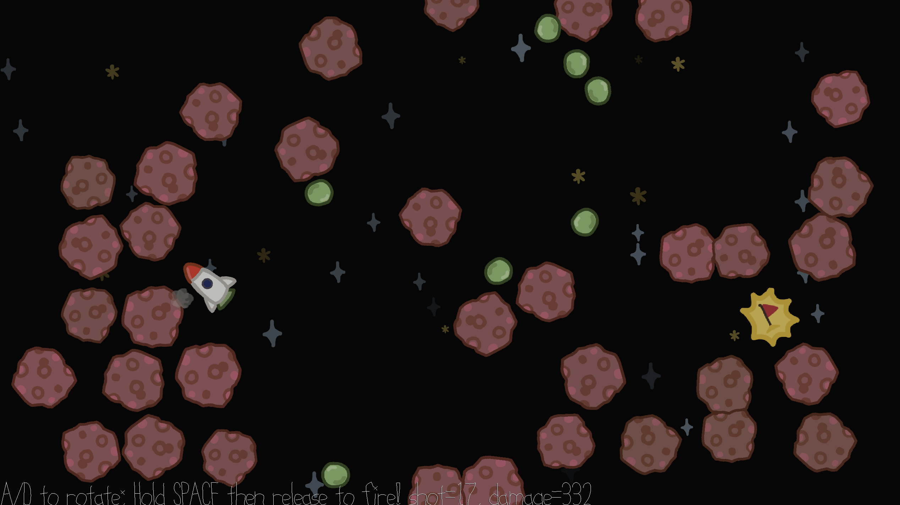

# Peashooter Rocket Science

**Author**: Runkun Chen (runkunc)

**Design**: A game about navigating a shabby rocket powered by shooting giant pea cannonballs through asteroids to reach the goal. Beware that pea cannonballs may bounce back and hit the rocket.

#### Screenshot

#### How To Play

- Keyboard **[A]** and **[D]** for adjusting the rocket's orientation;
- Hold **[Space]** to charge up, and release [Space] to fire a cannonball;

##### Debug buttons
- Num **[1/2/3/4]**: adjust physics frame frequency. 
  - 1=60FPS; 2=30FPS; 3=12FPS; 4=2FPS.
  - doesn't affect the timestep used for physics calculation, which is always 1/60 second.
- Hold **[R]** to rewind time.
  - [R] rewinds physics system but *not* game statistics. For example, the game tracks the amount of damage taken and number of cannonballs fired, but these values wouldn't reset after rewinding.

##### Game goal
- Reach the Goal
- For extra challenge, try minimize the time used, number of peas fired, and damage taken.
  - "Time used" is tracked in real-world time, no matter the physics framerate.
  - Rocket receives "Damage" when it collides with something. The value of Damage correlates with the momentum transferred at impact.
    - Damage has no influence on gameplay. There is no penalty for taking too much damage, for example.

## Extra Credit

> Are your Physics Deterministic? If so, how can we verify this?

Yes! Use the low framerate mode (press [4] on keyboard) to observe physics or feed input slowly, and use Rewind (press [R]) to replay from the same game state.

> Are your Physics Rewindable? If so, how can we verify this?

Yes! Press [R].
Rewind is achieved by logging physics states. There is a hardcoded limit on the log (24000 frames) to avoid accidentally using too much memory.

This game was built with [NEST](NEST.md).
